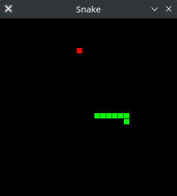

# Snake Game
A snake game written with [ggez](https://crates.io/crates/ggez) in rust.
Mainly adapted from [@termhn](https://github.com/termhn/ggez_snake), which is in turn adapted from this [video](https://www.youtube.com/watch?v=HCwMb0KslX8).

## Notes
Build [readme](https://github.com/ggez/ggez/blob/master/docs/BuildingForEveryPlatform.md) for ggez.
